# Exercise.Application - Application Layer

The application layer orchestrates business workflows and coordinates between the API and Domain layers. Built with CQRS, Mediator pattern, and Clean Architecture principles for maintainable and testable business logic.

## 🏗️ Architecture Philosophy

The application layer follows these key principles:

- **CQRS (Command Query Responsibility Segregation)** - Separate read/write operations
- **Mediator Pattern** - Decoupled request/response handling
- **Clean Architecture** - Independent of infrastructure concerns
- **SOLID Principles** - Maintainable and extensible design
- **Defensive Programming** - Input validation and error handling
- **Dependency Inversion** - Depends on abstractions, not implementations

## 📁 Project Structure

```plaintext
Exercise.Application/
├── Abstractions/           # Contracts and interfaces
│   └── Repositories/      # Repository interfaces (data access contracts)
│       └── ✅ IExerciseRepository.cs
├── Common/                # Shared application utilities
│   └── Behaviors/         # MediatR pipeline behaviors
├── Exercises/             # Exercise-related application logic
│   ├── Dtos/             # Data Transfer Objects for exercises
│   │   └── ✅ ExerciseDto.cs
│   └── Mapping/          # AutoMapper profiles
│       └── ✅ ExerciseProfile.cs
├── Features/             # Feature-organized application logic
│   └── Exercises/        # Exercise feature vertical slices
│       ├── Mapping/      # AutoMapper profiles
│       │   └── ✅ ExerciseProfile.cs
│       └── Queries/      # Read operations (CQRS)
│           ├── GetExercisesByBodyPart/
│           │   ├── ✅ GetExercisesByBodyPartQuery.cs
│           │   ├── ✅ GetExercisesByBodyPartQueryValidator.cs
│           │   └── ✅ GetExercisesByBodyPartQueryHandler.cs
│           ├── GetAllExercises/
│           │   ├── ✅ GetAllExercisesQuery.cs
│           │   └── ✅ GetAllExercisesQueryHandler.cs
│           └── GetExercisesById/
│               ├── ✅ GetExercisesByIdQuery.cs
│               └── ✅ GetExercisesByIdQueryHandler.cs
├── DependencyInjection.cs # Service registration
├── Exercise.Application.csproj
└── README.md            # This file

Legend: ✅ Completed | ⏳ Planned | 🔄 In Progress
```

## ⚡ Current Implementation Status

### ✅ **Completed Components**

#### **1. Repository Abstraction**

```csharp
// Exercise.Application/Abstractions/Repositories/IExerciseRepository.cs
public interface IExerciseRepository
{
    Task<IReadOnlyList<ExerciseEntity>> GetByBodyPartAsync(string bodyPart, 
        CancellationToken cancellationToken = default);
    Task<IReadOnlyList<ExerciseEntity>> GetAllAsync(
        CancellationToken cancellationToken = default);
    Task<ExerciseEntity?> GetByIdAsync(Guid id, 
        CancellationToken cancellationToken = default);
}
```

**Design Patterns Applied:**

- **Repository Pattern** - Abstracts data access
- **Dependency Inversion** - Application defines the contract
- **Using Alias Pattern** - Resolves namespace conflicts cleanly

**Key Features:**

- Async/await support with CancellationToken
- Returns IReadOnlyList for defensive programming  
- Comprehensive XML documentation
- Namespace conflict resolution using aliases

#### **2. CQRS Query Handlers - ✅ Complete**

**Implemented Handlers:**
- **GetExercisesByBodyPartQueryHandler** - Filter exercises by body part
- **GetAllExercisesQueryHandler** - Retrieve all exercises
- **GetExercisesByIdQueryHandler** - Get specific exercise by ID

**Features:**
- Full async/await implementation with CancellationToken
- AutoMapper integration for entity-to-DTO mapping
- Dependency injection with IExerciseRepository
- Comprehensive error handling and validation
- Clean Architecture compliance

#### **3. AutoMapper Configuration - ✅ Complete**

```csharp
// Exercise.Application/Features/Exercises/Mapping/ExerciseProfile.cs
public class ExerciseProfile : Profile
{
    public ExerciseProfile()
    {
        CreateMap<ExerciseEntity, ExerciseDto>();
    }
}
```

**Features:**
- Entity-to-DTO mapping configuration
- Comprehensive unit test coverage
- Integration with dependency injection

#### **2. Dependency Injection Setup**

```csharp
// Exercise.Application/DependencyInjection.cs
public static IServiceCollection AddApplication(this IServiceCollection services)
{
    services.AddMediatR(Assembly.GetExecutingAssembly());
    services.AddValidatorsFromAssembly(Assembly.GetExecutingAssembly());
    services.AddAutoMapper(Assembly.GetExecutingAssembly());
    return services;
}
```

**Registered Services:**

- **MediatR** (v11.1.0) - Request/response mediator
- **FluentValidation** (v11.9.0) - Input validation  
- **AutoMapper** (v12.0.1) - Object-to-object mapping

### ⏳ **Planned Components (Next Vertical Slice)**

#### **3. Data Transfer Objects (DTOs)**

```csharp
// Exercise.Application/Exercises/Dtos/ExerciseDto.cs (planned)
public class ExerciseDto
{
    public string Id { get; set; } = string.Empty;
    public string Name { get; set; } = string.Empty;
    public string BodyPart { get; set; } = string.Empty;
    public string TargetMuscle { get; set; } = string.Empty;
    public string Equipment { get; set; } = string.Empty;
    public string GifUrl { get; set; } = string.Empty;
    public List<string> Instructions { get; set; } = new();
    public List<string> SecondaryMuscles { get; set; } = new();
}
```

#### **4. CQRS Implementation**

```csharp
// Exercise.Application/Exercises/Queries/GetExercisesByBodyPart/ (planned)

// Query (Request)
public record GetExercisesByBodyPartQuery(string BodyPart) : IRequest<IReadOnlyList<ExerciseDto>>;

// Validator
public class GetExercisesByBodyPartValidator : AbstractValidator<GetExercisesByBodyPartQuery>

// Handler
public class GetExercisesByBodyPartHandler : IRequestHandler<GetExercisesByBodyPartQuery, IReadOnlyList<ExerciseDto>>
```

## 🎯 Design Patterns Implemented

### **1. Repository Pattern** 🗄️

```csharp
public interface IExerciseRepository
{
    Task<IReadOnlyList<ExerciseEntity>> GetByBodyPartAsync(string bodyPart, CancellationToken cancellationToken);
}
```

**Benefits:**

- Abstracts data access logic
- Enables unit testing with mocking
- Supports multiple data source implementations
- Follows Dependency Inversion Principle

### **2. CQRS Pattern** 📝

**Separation of Concerns:**

- **Queries** - Read operations (GetExercisesByBodyPart)
- **Commands** - Write operations (future: CreateExercise, UpdateExercise)

**Benefits:**

- Optimized read/write models
- Scalability through separation
- Different validation rules for reads vs writes

### **3. Mediator Pattern** 🚦

**Implementation:** MediatR library

```csharp
// API Layer usage (future)
var query = new GetExercisesByBodyPartQuery("chest");
var result = await mediator.Send(query);
```

**Benefits:**

- Decouples request/response handling
- Single point of entry for business operations
- Pipeline behaviors for cross-cutting concerns

### **4. DTO Pattern** 📦

**Purpose:** Shape data for API communication
**Benefits:**

- Stable API contracts
- Protection of internal domain models
- Optimized data transfer

## 🔧 Technical Implementation

### **Package Dependencies**

```xml
<PackageReference Include="AutoMapper" Version="12.0.1" />
<PackageReference Include="AutoMapper.Extensions.Microsoft.DependencyInjection" Version="12.0.1" />
<PackageReference Include="FluentValidation" Version="11.9.0" />
<PackageReference Include="FluentValidation.DependencyInjectionExtensions" Version="11.9.0" />
<PackageReference Include="MediatR" Version="11.1.0" />
<PackageReference Include="MediatR.Extensions.Microsoft.DependencyInjection" Version="11.1.0" />
```

### **Project References**

```xml
<ProjectReference Include="..\Exercise.Domain\Exercise.Domain.csproj" />
<ProjectReference Include="..\Exercise.Infrastructure\Exercise.Infrastructure.csproj" />
```

## 🚀 Request/Response Flow

```mermaid
sequenceDiagram
    participant API as 🌐 API Layer
    participant Med as 🚦 Mediator
    participant Val as ✅ Validator  
    participant Han as 🧠 Handler
    participant Repo as 🗄️ Repository
    participant Map as 🔄 Mapper

    API->>Med: Send(GetExercisesByBodyPartQuery)
    Med->>Val: Validate query
    Val-->>Med: ✅ Valid
    Med->>Han: Handle(query)
    Han->>Repo: GetByBodyPartAsync("chest")
    Repo-->>Han: List<ExerciseEntity> (domain)
    Han->>Map: Map to DTOs
    Map-->>Han: List<ExerciseDto>
    Han-->>Med: Result
    Med-->>API: List<ExerciseDto>
```



## 🛡️ SOLID Principles Applied

### **Single Responsibility Principle (SRP)** ✅

- **IExerciseRepository**: Only handles exercise data access
- **Validator**: Only validates input
- **Handler**: Only orchestrates workflow
- **DTO**: Only shapes data for transfer

### **Open/Closed Principle (OCP)** ✅

- **Interfaces**: Open for extension (new implementations)
- **Handlers**: Closed for modification, open for new queries/commands

### **Liskov Substitution Principle (LSP)** ✅  

- **Repository implementations**: Any implementation can substitute the interface
- **MediatR handlers**: Follow consistent request/response contracts

### **Interface Segregation Principle (ISP)** ✅

- **Focused interfaces**: Each interface has single, focused responsibility
- **No fat interfaces**: Clients only depend on methods they use

### **Dependency Inversion Principle (DIP)** ✅

- **High-level modules**: Application layer depends on abstractions
- **Low-level details**: Infrastructure implements the abstractions
- **Inward dependencies**: All dependencies point toward the domain

## 🧪 Testing Strategy

### **Unit Testing Approach**

```csharp
// Example: Handler unit test (planned)
[Test]
public async Task Handle_ValidBodyPart_ReturnsExerciseDtos()
{
    // Arrange
    var mockRepository = new Mock<IExerciseRepository>();
    var mockMapper = new Mock<IMapper>();
    var handler = new GetExercisesByBodyPartHandler(mockRepository.Object, mockMapper.Object);
    
    // Act
    var result = await handler.Handle(new GetExercisesByBodyPartQuery("chest"), CancellationToken.None);
    
    // Assert
    Assert.NotNull(result);
}
```

### **Testing Categories**

- **Handler Logic** - Business workflow testing
- **Validation Rules** - Input validation testing  
- **Mapping Configuration** - AutoMapper profile testing
- **Integration** - End-to-end request flow testing

## 📋 Best Practices Implemented

### **Defensive Programming** 🛡️

```csharp
// IReadOnlyList prevents external modification
Task<IReadOnlyList<ExerciseEntity>> GetByBodyPartAsync(...)

// CancellationToken support for async operations
public async Task<IReadOnlyList<ExerciseDto>> Handle(GetExercisesByBodyPartQuery request, 
    CancellationToken cancellationToken)
```

### **Namespace Conflict Resolution** 🔧

```csharp
// Using alias to resolve Exercise class vs Exercise namespace conflict
using ExerciseEntity = Exercise.Domain.Entities.Exercise;
```

### **Comprehensive Documentation** 📚

```csharp
/// <summary>
/// Retrieves all exercises filtered by the specified body part
/// </summary>
/// <param name="bodyPart">The body part to filter exercises by</param>
/// <param name="cancellationToken">A cancellation token for the operation</param>
/// <returns>A read-only list of exercises that match the specified body part</returns>
```

## 🧪 Testing Coverage - ✅ **Complete**

### **Unit Test Infrastructure**

Comprehensive unit test suite implemented with modern C# testing patterns:

**Test Framework Stack:**
- **xUnit** - Primary testing framework with [Fact] attributes
- **Moq** - Mock framework for dependency injection testing  
- **FluentAssertions** - Readable assertion syntax with `.Should()` patterns
- **AutoMapper Testing** - Configuration validation and mapping tests

**Implemented Tests:**
- ✅ **AutoMapper Profile Tests** - Validates entity-to-DTO mapping configuration
- ✅ **Handler Unit Tests** - GetExercisesByBodyPartQueryHandler with full AAA pattern
- ⏳ **Additional Handler Tests** - GetAllExercises and GetById handlers
- ⏳ **Integration Tests** - End-to-end pipeline testing

**C# Testing Concepts Demonstrated:**
- Async/await testing patterns with CancellationToken  
- Mock<T> generic types and dependency injection
- Constructor-based test setup with AutoMapper configuration
- Arrange-Act-Assert test structure
- FluentAssertions for expressive test validation
- Interface abstraction testing with repository mocks

**Test Documentation:** See [Testing README](../Exercise.Application.Tests/README.md)

## 🚀 Next Development Steps

### **Immediate Priorities**

1. ✅ ~~**Create ExerciseDto** - Define API response shape~~
2. ✅ ~~**AutoMapper Profile** - Configure domain entity to DTO mapping~~
3. ✅ ~~**Query Implementation** - Complete GetExercisesByBodyPart vertical slice~~
4. ✅ ~~**Handler Logic** - Orchestrate repository calls and mapping~~
5. **Complete Remaining Handler Tests** - GetAllExercises and GetById test coverage

### **Future Enhancements**

1. **Pipeline Behaviors** - Logging, performance monitoring, caching
2. **Command Operations** - Create, Update, Delete exercises
3. **Advanced Queries** - Search, filtering, pagination
4. **Error Handling** - Custom exceptions and error responses
5. **Caching Strategy** - Response caching and distributed caching
6. **Integration Tests** - Full CQRS pipeline with in-memory database

## 🔗 Related Layers

- **Domain Layer** (`Exercise.Domain`) - Business entities and logic
- **Infrastructure Layer** (`Exercise.Infrastructure`) - Data access implementations
- **API Layer** (`Exercise.API`) - HTTP endpoints and controllers

## 📖 References

- [MediatR Documentation](https://github.com/jbogard/MediatR)
- [FluentValidation Documentation](https://docs.fluentvalidation.net/)
- [AutoMapper Documentation](https://docs.automapper.org/)
- [Clean Architecture by Robert C. Martin](https://blog.cleancoder.com/uncle-bob/2012/08/13/the-clean-architecture.html)
- [CQRS Pattern](https://martinfowler.com/bliki/CQRS.html)
